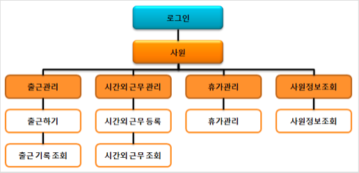
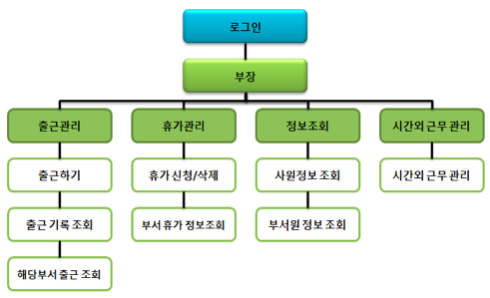
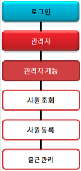
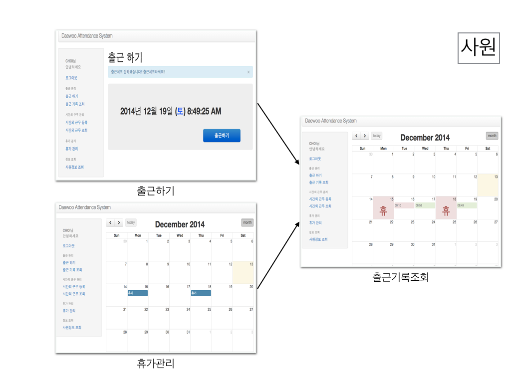
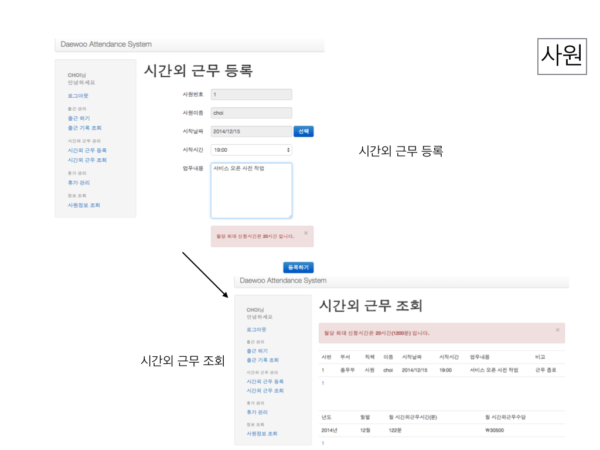
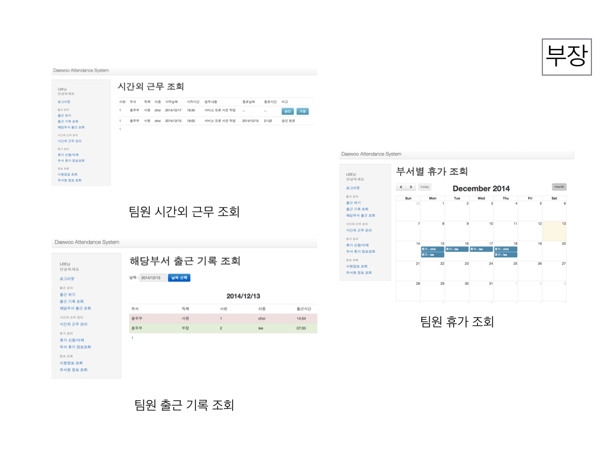

# 근태관리시스템

### 시스템 설명

###### 근태 관리의 필요성
 근태는 인사 평가에 영향을 미치는 중요 요소 중 하나이다.
 
###### 근태관리시스템의 필요성
 간결하고 인터페이스로 구성된 근태관리시스템을 통해 근태관리를 쉽게 할 수 있다.  
 모바일이 지원되어 접근성이 높다.  
 
###### 근태관리시스템 기능

### 프로젝트 설명

###### 개발 기간
2013.10.01 ~ 2013.10.31 (1개월)  
*이 프로젝트는 대우정보시스템 Java Web 개발자 교육과정에서 만든 팀 프로젝트 입니다.*  
*회사의 산출물이 아닌 것을 밝힙니다.*  

###### 참여 인원
6명

###### 담당 업무
- 로그인, 시간외근무관리, 관리자(사원 등록 및 조회, 출/퇴근 기록 수정) 기능 로직 구현
- jQuery, Bootstrap, FullCalendar 적용 지원.

###### 개발 환경
- OS: Window7
- Front-end: HTML5, BootStrap 2.3.2, jQuery 1.10.1
- Back-end: Spring Framework 3.0.2, iBatis 2.3.4
- DB: Oracle10g -> *현재는 MySQL로 커스터마이징 하였습니다.*
- Server: Tomcat 6.0

